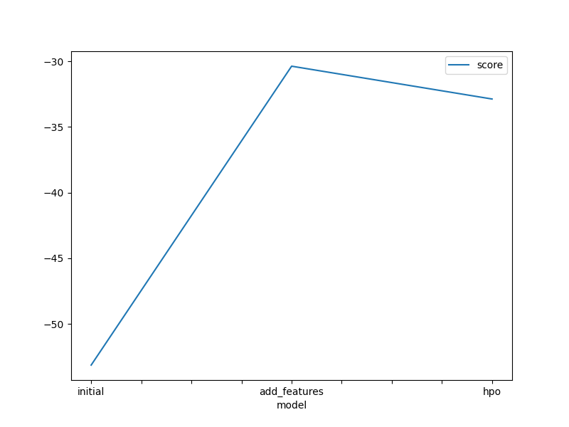
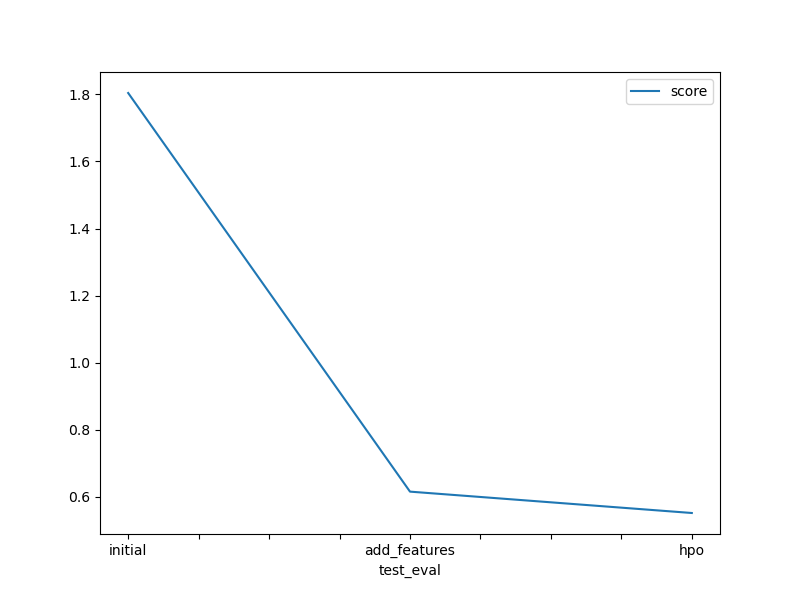

# Report: Predict Bike Sharing Demand with AutoGluon Solution
#### NAME HERE

## Initial Training
### What did you realize when you tried to submit your predictions? What changes were needed to the output of the predictor to submit your results?
After the initial predictions were generated, it was necessary to adjust the output to match Kaggle's submission requirements. 
Specifically, all negative prediction values were set to zero because the count of bikes cannot be negative. 
Additionally, I need to create new csv after every new prediction, and we need to validate our model onto the test file, then put it to the column count in submission file. 

### What was the top ranked model that performed?
The top-performing model in the initial training phase was a Weighted Ensemble L3. 
This model combined predictions from various base models and layers, effectively improving performance by leveraging the strengths of each constituent model.

## Exploratory data analysis and feature creation
### What did the exploratory analysis find and how did you add additional features?
The exploratory data analysis revealed patterns and trends related to time variables, such as hours and days. 
Based on these insights, new features were created, including 'hour of the day', 'day of the week', and 'month', which helped capture the repeated nature of bike rental demand.

### How much better did your model preform after adding additional features and why do you think that is?
After adding additional features, the model's Kaggle score improved from 1.80385 to 0.61583, representing a percentage increase of approximately 65.85%. Despite the negative percentage increase, adding additional features likely provided the model with more relevant information to make predictions, which could have improved its generalization and predictive performance.

## Hyper parameter tuning
### How much better did your model preform after trying different hyper parameters?
After trying different hyperparameters through hyperparameter optimization, the model's Kaggle score further improved to 0.55215, indicating a percentage increase of approximately 69.41% compared to the initial score. Hyperparameter optimization fine-tuned the model's parameters, potentially leading to better generalization and performance on unseen data.

### If you were given more time with this dataset, where do you think you would spend more time?
Given more time, I would explore additional feature engineering, particularly focusing on weather conditions and integrating external data sources like local events which could influence bike rental demand. 

### Create a table with the models you ran, the hyperparameters modified, and the kaggle score.
| model | hpo1 | hpo2 | hpo3 | score |
|-------|------|------|------|-------|
| initial | default | default | default | 1.80385 |
| add_features | default | default | default | 0.61583 |
| hpo | num_boost_round=100 | num_leaves=20 | n_estimators=100, 200; max_depth=10, 20 | 0.55215 |

### Create a line plot showing the top model score for the three (or more) training runs during the project.

TODO: Replace the image below with your own.

### Create a line plot showing the top kaggle score for the three (or more) prediction submissions during the project.

TODO: Replace the image below with your own.

## Summary
This project successfully demonstrated the application of AutoGluon to predict bike sharing demand, achieving substantial improvements through exploratory data analysis, feature engineering, and hyperparameter tuning. 
