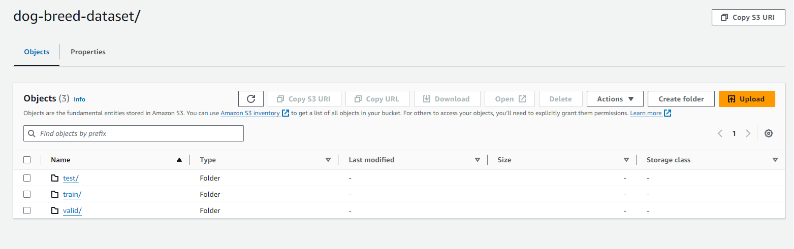

# Image Classification using AWS SageMaker

Capstone Project: Fine-Tuning a Pretrained Model with AWS SageMaker

## Project Overview

This project demonstrates how to use Amazon SageMaker to build, train, and deploy an image classification model. The model is based on a pre-trained ResNet50 network from the torchvision library, fine-tuned for a specific classification task.

## Project Objectives and Outcomes

- **Model Fine-Tuning**: Choose a pre-trained model, such as ResNet50, and apply transfer learning techniques to adapt it to your chosen dataset.
- **SageMaker Features**: Implement SageMaker's profiling and debugging tools to monitor model training and performance. Conduct hyperparameter tuning to optimize your model's performance.
- **Model Deployment**: Deploy your fine-tuned model to a SageMaker endpoint. Ensure that you can query the deployed model with a sample image to retrieve a prediction.


## Setup Instructions
Enter AWS through the gateway in the course and open SageMaker Studio. 
Download the starter files.
Download/Make the dataset available.

### Steps to Set Up and run the project
- Open the AWS sagemaker console.
- Navigate to Notebook instances & create a Notebook instance
- Upload the following files to the instance:
    - ```train_and_deploy.ipynb``` : notebook for interfacing with sagemaker & downloading the dataset.
    - ```scripts/train_model.py``` : script for training the model with debugging & profilling hooks.
    - ```scripts/hpo.py``` : script for training the model without debugging & profilling hooks for hyperparameter tuning.
    - ```scripts/inference.py``` : script for model deployment to an endpoint.
- Run the notebook cells to download the data, upload it to s3, launch the hyperparameter tuning job, launch the training job, display the debugging & profilling outputs & finally deployment and querying the model.

### Dataset
The provided dataset is the dog breed classification dataset which can be found in the classroom. 
It contains images from 133 dog breeds divided into training, testing and validation datasets. The dataset can be 
downloaded from [here](https://s3-us-west-1.amazonaws.com/udacity-aind/dog-project/dogImages.zip).

**Note**: The project is designed to be dataset independent so if there is a dataset that is more interesting or relevant to your work, you are welcome to use it to complete the project.


### Access
Upload them to an S3 bucket so that Sagemaker can use them for training.

[](#)
