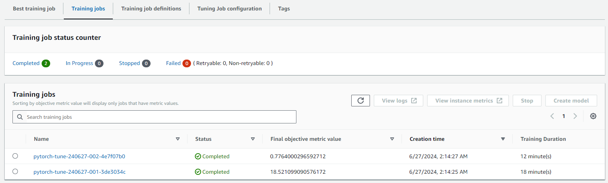
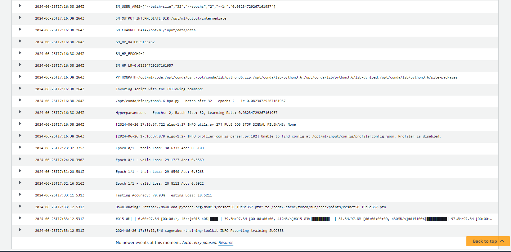
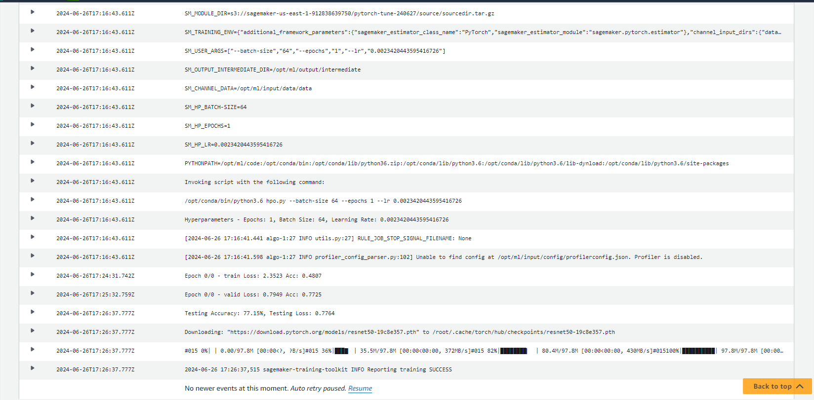
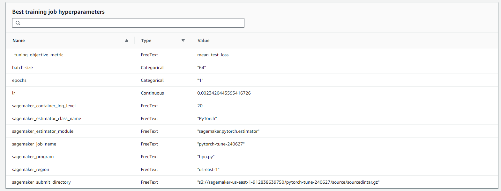
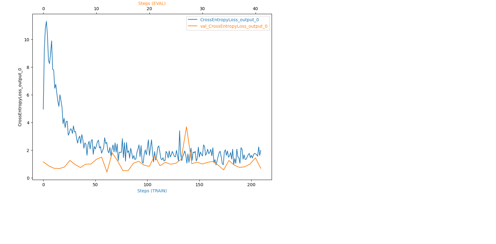
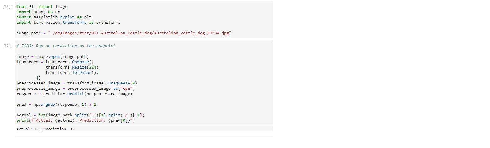

# Image Classification using AWS SageMaker

Capstone Project: Fine-Tuning a Pretrained Model with AWS SageMaker

## Project Overview

This project demonstrates how to use Amazon SageMaker to build, train, and deploy an image classification model. The model is based on a pre-trained ResNet50 network from the torchvision library, fine-tuned for a specific classification task.

## Project Objectives and Outcomes

- **Model Fine-Tuning**: Choose a pre-trained model, such as ResNet50, and apply transfer learning techniques to adapt it to your chosen dataset.
- **SageMaker Features**: Implement SageMaker's profiling and debugging tools to monitor model training and performance. Conduct hyperparameter tuning to optimize your model's performance.
- **Model Deployment**: Deploy your fine-tuned model to a SageMaker endpoint. Ensure that you can query the deployed model with a sample image to retrieve a prediction.


## Setup Instructions
Enter AWS through the gateway in the course and open SageMaker Studio. 
Download the starter files.
Download/Make the dataset available.

### Steps to Set Up and run the project
- Open the AWS sagemaker console.
- Navigate to Notebook instances & create a Notebook instance
- Upload the following files to the instance:
    - ```train_and_deploy.ipynb``` : notebook for interfacing with sagemaker & downloading the dataset.
    - ```scripts/train_model.py``` : script for training the model with debugging & profilling hooks.
    - ```scripts/hpo.py``` : script for training the model without debugging & profilling hooks for hyperparameter tuning.
    - ```scripts/inference.py``` : script for model deployment to an endpoint.
- Run the notebook cells to download the data, upload it to s3, launch the hyperparameter tuning job, launch the training job, display the debugging & profilling outputs & finally deployment and querying the model.

### Dataset
The provided dataset is the dog breed classification dataset which can be found in the classroom. 
It contains images from 133 dog breeds divided into training, testing and validation datasets. The dataset can be 
downloaded from [here](https://s3-us-west-1.amazonaws.com/udacity-aind/dog-project/dogImages.zip).

**Note**: The project is designed to be dataset independent so if there is a dataset that is more interesting or relevant to your work, you are welcome to use it to complete the project.


### Access
Upload them to an S3 bucket so that Sagemaker can use them for training.

[](#)

### Hyperparameter Tuning

I chose ResNet50 for its ease of use, light weight, and computational power.

To hyperparameter tuning, I tried different values for the following hyperparameters:
- lr: ContinuousParameter(0.001, 0.1)
- batch_size: CategoricalParameter([32, 64, 128])
- epochs: IntegerParameter(1, 2)

### Steps to using the ```Resnet50``` model:
- Load the Pretrained Model: The model is loaded from the torchvision library.
- Freeze Weights: The model's weights are frozen to prevent them from being updated during training, allowing it to serve as a feature extractor.
- Replace Fully Connected Layer: The final fully connected layer is replaced with a new layer that reduces the output to 133 classes, corresponding to the 133 classes in the Dog Breed Dataset.
- Softmax Layer: A Softmax layer (specifically a log softmax layer within the cross-entropy loss function) converts the outputs into probabilities.
- Train Fully Connected Layer: The newly added fully connected layer is trained using the cross-entropy loss function for multiclass classification, optimized with the ADAM optimizer.

### Hyperparameters Chosen
- Learning Rate (lr): A small value on a log scale that influences training speed. An appropriate learning rate ensures the training process converges without diverging.
- Batch Size: This affects both training speed and accuracy. Larger batch sizes provide more stable output values but can lengthen the training process.
- Epochs: More training epochs generally improve results, but excessive training can lead to overfitting.

### Hyperparameters tuning Space

<table>
    <tr>
        <th>Hyperparameter</th>
        <th>Type</th>
        <th>Range</th>
    </tr>
        <td>Learning Rate</td>
        <td>Continous</td>
        <td>interval: [0.001, 0.1]</td>
    </tr>
        <td>Batch Size</td>
        <td>Categorical</td>
        <td>Values : [32, 64, 128]</td>
    </tr>
        <td>Epochs</td>
        <td>Categorical</td>
        <td>Values: [1, 2]</td>
    </tr>
</table>

### Hyperparameter Tuning Job

**The following are screenshots from the jobs ran on AWS Cloud Gateway:**

A screenshot showing the completed hyperparamter tuning job.




A screenshot showing the logged train, valid and test accuracies & losses from Cloudwatch logs
- first job



- second job (best)



And finally, the best config is:



## Debugging and Profiling

Since we have a training job with best hyperparameters, we directly debug and profile that job with the following
configuration:

```
rules = [
    Rule.sagemaker(rule_configs.vanishing_gradient()),
    Rule.sagemaker(rule_configs.overfit()),
    Rule.sagemaker(rule_configs.overtraining()),
    Rule.sagemaker(rule_configs.poor_weight_initialization()),
    ProfilerRule.sagemaker(rule_configs.ProfilerReport()),
]

profiler_config = ProfilerConfig(
    system_monitor_interval_millis=500, framework_profile_params=FrameworkProfile(num_steps=10)
)

debugger_config = DebuggerHookConfig(
    hook_parameters={"train.save_interval": "100", "eval.save_interval": "10"}
)

profiler_config = ProfilerConfig(
    system_monitor_interval_millis=500, framework_profile_params=FrameworkProfile()
)

collection_configs=[
    CollectionConfig(
        name="weights",
        parameters={
            "train.save_interval": "5",
            "eval.save_interval": "1"
        }
    ),
    CollectionConfig(
        name="gradients",
        parameters={
            "train.save_interval": "5",
            "eval.save_interval": "1"
        }
    ),
    CollectionConfig(
        name="biases",
        parameters={
            "train.save_interval": "5",
            "eval.save_interval": "1"
        }
    ),
    CollectionConfig(
        name="CrossEntopyLoss_output_0", 
        parameters={
            "include_regex": "CrossEntropyLoss_output_0",
            "train.save_interval": "1",
            "eval.save_interval": "1"
        }
    )
]
```

### Results

#### Debugger Line plot

[](#)

Training Loss Trend: The training loss decreases as the number of steps increases.
Noisy Training Loss: The training loss shows some noise, which could indicate that a larger batch size might be beneficial.
Validation Loss Behavior: The validation loss remains almost constant and is significantly lower than the training loss from the start, suggesting potential overfitting.

## Model Deployment

The model deployment is handled using a stand-alone script (inference.py in our project). 

In notebook, we use the script as shown below:

With having ```predictor``` instance, we can invoke the endpoint by some predictions:

[](#)