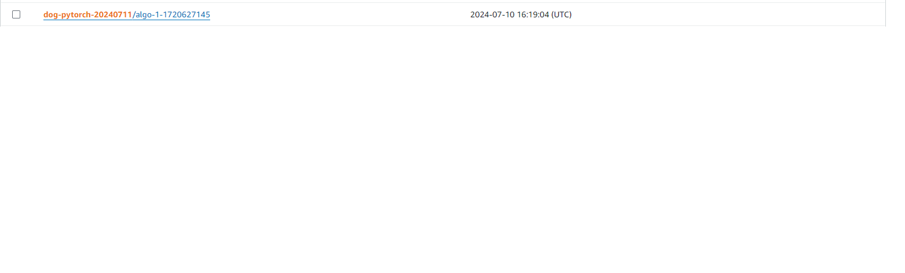

# Dog Image Classification

## Overview

In this project, we will follow the steps below:

- Train and deploy a model on Sagemaker, using the most appropriate instances. Set up multi-instance training in your Sagemaker notebook.
- Adjust your Sagemaker notebooks to perform training and deployment on EC2.
- Set up a Lambda function for your deployed model. Set up auto-scaling for your deployed endpoint as well as concurrency for your Lambda function.
- Ensure that the security on your ML pipeline is set up properly.

## Steps Involved

### Step 1: Training and Deployment on SageMaker

#### Notebook Instance
Created sagemaker notebook instance I have used ml.t3.medium as this is suffiecint to run my notebook.


#### S3 Bucket
I had also prepared the s3 bucket like below


### Hyperparameter tunning

SM_CHANNEL_TRAINING: where the data used to train model is located in AWS S3

SM_MODEL_DIR: where model artifact will be saved in S3

SM_OUTPUT_DATA_DIR: where output will be saved in S3


Here we are passing some paths to our S3 which will be used by the notebook instance to get data, save model and output
```python
os.environ['SM_CHANNEL_TRAINING']='s3://udacitysolution84/'
os.environ['SM_MODEL_DIR']='s3://udacitysolution84/model/'
os.environ['SM_OUTPUT_DATA_DIR']='s3://udacitysolution84/output/'
```

#### Single Instance Training



#### Multi-instance Training
Explain the setup for multi-instance training, including instance count and configuration details.


#### Deployment
I had created two endpoints, one for single instance training and one for multi-instance training


### Step 2: EC2 Training

We can train model on EC2 instance as well. I chose AMI with required library already installed. Deep Learning NVIDIA Driver 2.3.0 has latest PyTorch version. 
Instance type selected was g3.xlarge because to low cost and according to the documentation, this type of AMI supports the following instances: G3, P3, P3dn, P4d, G5, and G4dn. 


So after pasting the code into EC2, and execute the script, we had this model.pth output


### Difference between EC2 script and notebook script

1. Execution Environment:

- ec2train1.py: Runs directly on an EC2 instance.
- train_and_deploy-solution.ipynb: Uses AWS SageMaker, an integrated development environment for machine learning.

2. Training and Deployment:

- ec2train1.py: Focuses solely on training the model.
- train_and_deploy-solution.ipynb: Includes both training and deployment steps, leveraging SageMaker's capabilities.

3. Resource Management:

- ec2train1.py: Manages resources directly on the EC2 instance.
- train_and_deploy-solution.ipynb: Manages resources through SageMaker, providing easier scalability and management.

4. Hyperparameter Tuning:

- ec2train1.py: May require manual tuning.
- train_and_deploy-solution.ipynb: Can include automated hyperparameter tuning using SageMaker.

5. Inference:

- ec2train1.py: Requires manual setup for inference after training.
- train_and_deploy-solution.ipynb: Provides a streamlined process for deploying and performing inference through SageMaker endpoints.

### Step 3: Lambda Function Setup

After training and deploying your model, setting up a Lambda function is an important next step. Lambda functions enable your model and its inferences to be accessed by API's and other programs, so it's a crucial part of production deployment.

I had copied the code and pasted it into lambda_function.py

```

import base64
import logging
import json
import boto3
#import numpy
logger = logging.getLogger(__name__)
logger.setLevel(logging.DEBUG)

print('Loading Lambda function')

runtime=boto3.Session().client('sagemaker-runtime')
endpoint_Name='pytorch-inference-2024-07-10-17-29-19-680'

def lambda_handler(event, context):

    #x=event['content']
    #aa=x.encode('ascii')
    #bs=base64.b64decode(aa)
    print('Context:::',context)
    print('EventType::',type(event))
    bs=event
    runtime=boto3.Session().client('sagemaker-runtime')
    
    response=runtime.invoke_endpoint(EndpointName=endpoint_Name,
                                    ContentType="application/json",
                                    Accept='application/json',
                                    #Body=bytearray(x)
                                    Body=json.dumps(bs))
    
    result=response['Body'].read().decode('utf-8')
    sss=json.loads(result)
    
    return {
        'statusCode': 200,
        'headers' : { 'Content-Type' : 'text/plain', 'Access-Control-Allow-Origin' : '*' },
        'type-result':str(type(result)),
        'COntent-Type-In':str(context),
        'body' : json.dumps(sss)
        #'updated_result':str(updated_result)

        }
```


### Step 4: Lambda Security Setup and Testing

#### Security Policies
Adding endpoints permission to lambda fucntions Lambda function is going to invoke deployed endpoint. However, the lambda function will only be able to invoke endpoint if it has the proper security policies attached to it. Two security policy has been attached to the role :

- Basic Lambda function execution
- Sagemaker endpoint invocation permission (I set it up to only allow specific endpoint)


Creating policy with permission to only invoke specific endpoint.

 ```
{
    "Version": "2012-10-17",
    "Statement": [
        {
            "Sid": "VisualEditor0",
            "Effect": "Allow",
            "Action": "sagemaker:InvokeEndpoint",
            "Resource": "arn:aws:sagemaker:*:271564095025:endpoint/pytorch-inference-2024-07-10-17-29-19-680"
        }
    ]
}
```


#### Testing Lambda Function
You will need to configure a test event for testing. Your lambda function will return a classification of the photo you submit. You can use the following text for your test event:
```
{ "url": "https://s3.amazonaws.com/cdn-origin-etr.akc.org/wp-content/uploads/2017/11/20113314/Carolina-Dog-standing-outdoors.jpg" }

```
After testing here is the output response


```
Test Event Name
test

Response
{
  "statusCode": 200,
  "headers": {
    "Content-Type": "text/plain",
    "Access-Control-Allow-Origin": "*"
  },
  "type-result": "<class 'str'>",
  "COntent-Type-In": "LambdaContext([aws_request_id=9185d2d9-82e6-42dc-b277-2e324ab94821,log_group_name=/aws/lambda/mlops84,log_stream_name=2024/07/10/[$LATEST]9e474c78ea0a4b77988b80e5d349a3c0,function_name=mlops84,memory_limit_in_mb=128,function_version=$LATEST,invoked_function_arn=arn:aws:lambda:us-east-1:769654117898:function:mlops84,client_context=None,identity=CognitoIdentity([cognito_identity_id=None,cognito_identity_pool_id=None])])",
  "body": "[[0.3558095097541809, 0.08181389421224594, 0.06885053962469101, 0.35397759079933167, 0.48187413811683655, 0.2201753407716751, 0.09730958938598633, 0.005671622697263956, -0.334695965051651, 0.15466246008872986, 0.35427066683769226, 0.4325163662433624, 0.01883544772863388, 0.3408735394477844, 0.416269451379776, 0.1993204802274704, 0.2586529850959778, -0.006215441972017288, 0.08511874079704285, 0.26309481263160706, 0.2630354166030884, -0.026104465126991272, -0.06433738768100739, 0.2561456263065338, -0.14950086176395416, -0.04721549153327942, 0.2909480631351471, -0.1495523452758789, 0.5128059387207031, 0.16000306606292725, 0.18676388263702393, 0.363736629486084, 0.025693409144878387, 0.3206824064254761, 0.14534996449947357, 0.24052593111991882, 0.1248016282916069, 0.18913066387176514, 0.3952156603336334, 0.21717162430286407, 0.31102558970451355, 0.2862562835216522, 0.046305835247039795, 0.28758156299591064, -0.04216467961668968, 0.3239177465438843, 0.13569234311580658, 0.13958483934402466, -0.013809559866786003, 0.11587280035018921, 0.30406972765922546, 0.09043887257575989, -0.01964092254638672, 0.26562103629112244, -0.05993936210870743, 0.2722195088863373, 0.3772754967212677, -0.08779757469892502, 0.04296911135315895, 0.29926642775535583, -0.05568487197160721, 0.18112200498580933, 0.057391468435525894, -0.11215139925479889, -0.12147768586874008, -0.23993916809558868, -0.15058961510658264, 0.20608052611351013, 0.06574470549821854, 0.061339836567640305, 0.3042256832122803, -0.032420940697193146, -0.04010149464011192, -0.022106176242232323, 0.012396248057484627, 0.26559606194496155, -0.03483740612864494, -0.0474972240626812, 0.27856865525245667, 0.040753867477178574, 0.22123287618160248, 0.3257914185523987, 0.013962291181087494, 0.143052875995636, -0.19455839693546295, 0.08568626642227173, 0.28333115577697754, 0.12242453545331955, 0.1435321718454361, 0.2329622209072113, 0.20733800530433655, -0.07821555435657501, -0.15479975938796997, 0.023197665810585022, -0.06326314061880112, -0.10727821290493011, 0.06960730999708176, 0.010669857263565063, -0.06612387299537659, -0.1729569137096405, 0.04850524663925171, -0.3445631265640259, 0.20869959890842438, -0.0409497395157814, -0.3103691339492798, 0.09354594349861145, -0.05638738349080086, -0.4463024139404297, -0.0494949147105217, -0.20361372828483582, 0.007505577523261309, 0.17976197600364685, -0.0729711726307869, -0.14637845754623413, 0.25685036182403564, -0.28022217750549316, 0.011163264513015747, 0.17834317684173584, -0.3444470763206482, -0.10345761477947235, -0.3302585184574127, -0.22321875393390656, -0.08803960680961609, 0.014949172735214233, -0.1294454038143158, -0.330605685710907, -0.03895445168018341, -0.3505779206752777, 0.05698646977543831, 0.05011641979217529, -0.3144388198852539, -0.3519354462623596, -0.3126114010810852]]"
}

Function Logs
Loading Lambda function
START RequestId: 9185d2d9-82e6-42dc-b277-2e324ab94821 Version: $LATEST
Context::: LambdaContext([aws_request_id=9185d2d9-82e6-42dc-b277-2e324ab94821,log_group_name=/aws/lambda/mlops84,log_stream_name=2024/07/10/[$LATEST]9e474c78ea0a4b77988b80e5d349a3c0,function_name=mlops84,memory_limit_in_mb=128,function_version=$LATEST,invoked_function_arn=arn:aws:lambda:us-east-1:769654117898:function:mlops84,client_context=None,identity=CognitoIdentity([cognito_identity_id=None,cognito_identity_pool_id=None])])
EventType:: <class 'dict'>
END RequestId: 9185d2d9-82e6-42dc-b277-2e324ab94821
REPORT RequestId: 9185d2d9-82e6-42dc-b277-2e324ab94821	Duration: 1451.26 ms	Billed Duration: 1452 ms	Memory Size: 128 MB	Max Memory Used: 76 MB	Init Duration: 385.71 ms

Request ID
9185d2d9-82e6-42dc-b277-2e324ab94821
```

### Step 5: Lambda Concurrency Setup and Endpoint Auto-scaling

#### Concurrency
Setting up concurrency for your Lambda function. 
Concurrency will make your Lambda function better able to accommodate high traffic because it will enable your function to respond to multiple invocations at once. 
I reserved 3 instances and provisioned 3 of them.


#### Auto-scaling
Sagemaker endpoints require automatic scaling to respond to high traffic. I enabled auto-scalling.


```
minimum instances: 1
maximum instances: 3
target value: 20    // number of simulataneous requests which will trigger scaling
scale-in time: 30 s
scale-out time: 30 s
```

